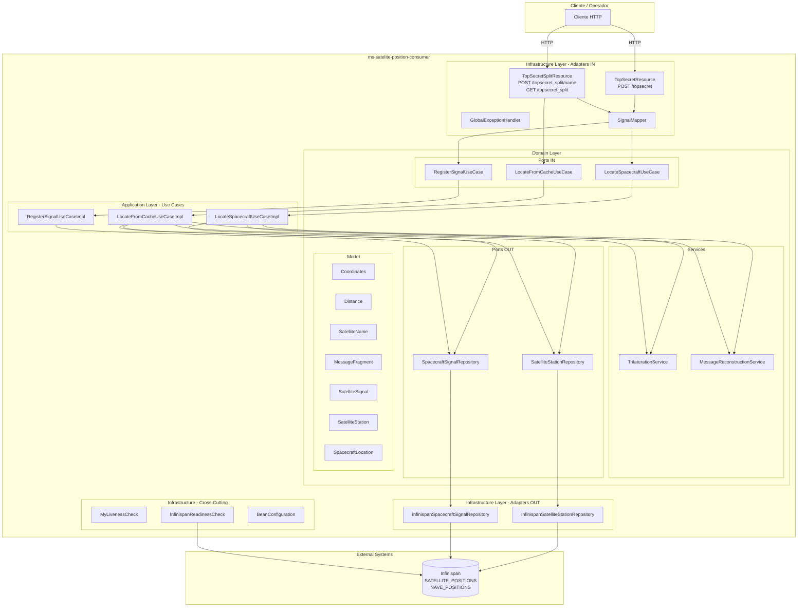
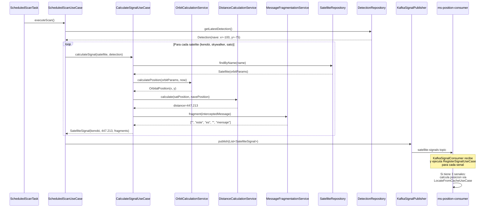
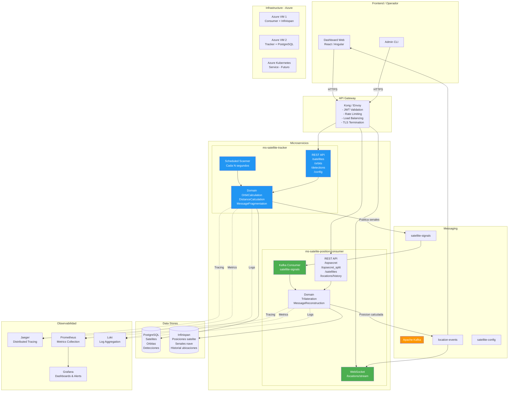
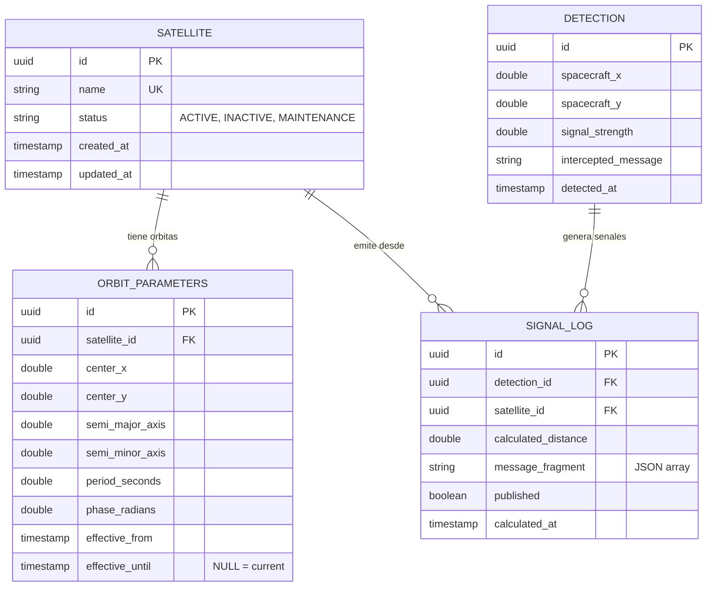
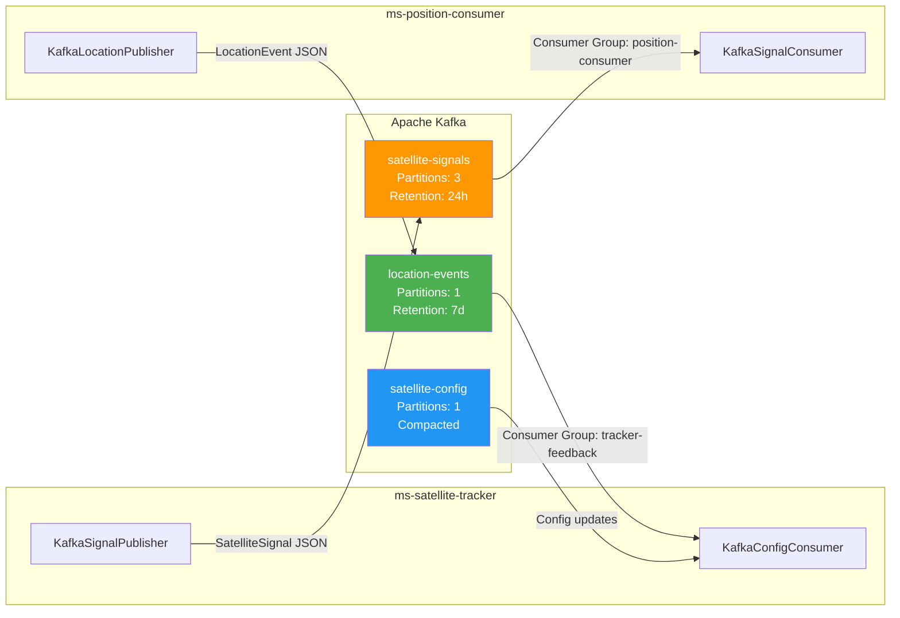
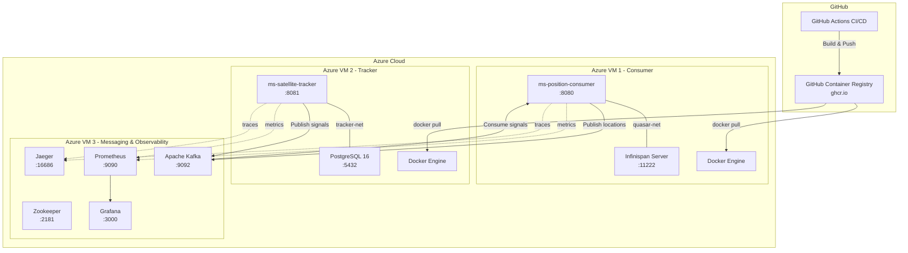

# Propuesta de Arquitectura - Quasar Fire Platform

## 1. Diagrama de Componentes Actual (ms-satelite-position-consumer)



---

## 2. Diagrama de Componentes Mejorado (ms-satelite-position-consumer v2)

```mermaid
graph TB
    subgraph "Clientes"
        CLIENT[Cliente HTTP]
        WS_CLIENT[Cliente WebSocket]
        TRACKER[ms-satellite-tracker<br/>Microservicio]
    end

    subgraph "API Gateway / Security"
        GW[API Gateway<br/>Rate Limiting<br/>JWT Validation]
    end

    subgraph "ms-satelite-position-consumer v2"
        subgraph "Infrastructure Layer - Adapters IN"
            TSR[TopSecretResource<br/>POST /topsecret]
            TSSR[TopSecretSplitResource<br/>POST /topsecret_split/name<br/>GET /topsecret_split]
            SAT_R[SatelliteResource<br/>GET /satellites<br/>GET /satellites/name]
            HIST_R[LocationHistoryResource<br/>GET /locations/history]
            KAFKA_C[KafkaSignalConsumer<br/>Canal: satellite-signals]
            WS_EP[WebSocket /locations/stream]
            GEH[GlobalExceptionHandler]
            SM[SignalMapper]
        end

        subgraph "Application Layer - Use Cases"
            LSU[LocateSpacecraftUseCaseImpl]
            RSU[RegisterSignalUseCaseImpl]
            LCU[LocateFromCacheUseCaseImpl]
            QSU[QuerySatellitesUseCaseImpl<br/>NUEVO]
            HSU[LocationHistoryUseCaseImpl<br/>NUEVO]
        end

        subgraph "Domain Layer"
            subgraph "Services"
                TS[TrilaterationService]
                MRS[MessageReconstructionService]
            end
            subgraph "Ports IN"
                P_LS[LocateSpacecraftUseCase]
                P_RS[RegisterSignalUseCase]
                P_LC[LocateFromCacheUseCase]
                P_QS[QuerySatellitesUseCase<br/>NUEVO]
                P_HS[LocationHistoryUseCase<br/>NUEVO]
            end
            subgraph "Ports OUT"
                P_SSR[SatelliteStationRepository]
                P_SPR[SpacecraftSignalRepository]
                P_LHR[LocationHistoryRepository<br/>NUEVO]
                P_EVT[LocationEventPublisher<br/>NUEVO]
            end
            subgraph "Model"
                COORD[Coordinates]
                DIST[Distance]
                SNAME[SatelliteName]
                MSGF[MessageFragment]
                SSIG[SatelliteSignal]
                SSTA[SatelliteStation]
                SLOC[SpacecraftLocation]
                LHIST[LocationRecord<br/>NUEVO]
            end
        end

        subgraph "Infrastructure Layer - Adapters OUT"
            ISSR[InfinispanSatelliteStationRepository<br/>+ Cache L1 Caffeine]
            ISPR[InfinispanSpacecraftSignalRepository<br/>+ @Retry + @CircuitBreaker]
            ILHR[InfinispanLocationHistoryRepository<br/>NUEVO]
            KAFKA_P[KafkaLocationEventPublisher<br/>NUEVO]
        end

        subgraph "Infrastructure - Cross-Cutting"
            HC_L[LivenessCheck<br/>Mejorado]
            HC_R[ReadinessCheck<br/>Valida satelites]
            HC_S[StartupCheck<br/>NUEVO]
            BEAN[BeanConfiguration]
            OTEL[OpenTelemetry<br/>Tracing]
            FT[Fault Tolerance<br/>Retry + CircuitBreaker]
            SEC[SecurityFilter<br/>JWT / API Key]
            METRICS[Custom Metrics<br/>Micrometer]
            BOOT[SatelliteBootstrap<br/>@Startup NUEVO]
        end
    end

    subgraph "External Systems"
        INFINISPAN[(Infinispan<br/>SATELLITE_POSITIONS<br/>NAVE_POSITIONS<br/>LOCATION_HISTORY)]
        KAFKA[[Apache Kafka<br/>satellite-signals<br/>location-events]]
        JAEGER[Jaeger / Zipkin<br/>Tracing]
        PROMETHEUS[Prometheus<br/>Metrics]
        GRAFANA[Grafana<br/>Dashboards]
    end

    CLIENT -->|HTTPS| GW
    WS_CLIENT -->|WSS| GW
    TRACKER -->|Kafka| KAFKA

    GW -->|JWT validated| TSR & TSSR & SAT_R & HIST_R
    GW -->|WSS| WS_EP
    KAFKA --> KAFKA_C

    TSR --> SM --> P_LS
    TSSR --> SM --> P_RS & P_LC
    SAT_R --> P_QS
    HIST_R --> P_HS
    KAFKA_C --> SM --> P_RS

    P_LS --> LSU --> TS & MRS
    P_RS --> RSU
    P_LC --> LCU --> TS & MRS
    P_QS --> QSU
    P_HS --> HSU

    LSU --> P_SSR & P_EVT
    LCU --> P_SSR & P_SPR & P_EVT
    RSU --> P_SPR
    QSU --> P_SSR
    HSU --> P_LHR

    P_SSR --> ISSR --> INFINISPAN
    P_SPR --> ISPR --> INFINISPAN
    P_LHR --> ILHR --> INFINISPAN
    P_EVT --> KAFKA_P --> KAFKA
    KAFKA_P --> WS_EP

    OTEL --> JAEGER
    METRICS --> PROMETHEUS --> GRAFANA
    BOOT -->|@Startup| INFINISPAN

    style KAFKA_C fill:#4CAF50,color:#fff
    style SAT_R fill:#4CAF50,color:#fff
    style HIST_R fill:#4CAF50,color:#fff
    style WS_EP fill:#4CAF50,color:#fff
    style KAFKA_P fill:#4CAF50,color:#fff
    style ILHR fill:#4CAF50,color:#fff
    style QSU fill:#4CAF50,color:#fff
    style HSU fill:#4CAF50,color:#fff
    style P_QS fill:#4CAF50,color:#fff
    style P_HS fill:#4CAF50,color:#fff
    style P_LHR fill:#4CAF50,color:#fff
    style P_EVT fill:#4CAF50,color:#fff
    style LHIST fill:#4CAF50,color:#fff
    style BOOT fill:#4CAF50,color:#fff
    style SEC fill:#FF9800,color:#fff
    style OTEL fill:#FF9800,color:#fff
    style FT fill:#FF9800,color:#fff
    style METRICS fill:#FF9800,color:#fff
```

> **Verde** = Componentes nuevos | **Naranja** = Mejoras cross-cutting

---

## 3. Nuevo Microservicio: ms-satellite-tracker

### 3.1 Propuesta

El **ms-satellite-tracker** es un microservicio independiente que simula y gestiona la telemetria de los satelites en tiempo real. Su responsabilidad es:

1. **Gestionar las posiciones orbitales** de cada satelite (kenobi, skywalker, sato)
2. **Calcular la distancia** de cada satelite respecto a la nave detectada
3. **Emitir senales periodicas** hacia `ms-satelite-position-consumer` via Kafka
4. **Exponer una API REST** para configurar satelites, consultar orbitas y ajustar parametros

### 3.2 Contexto de negocio

```
Flujo actual (manual):
  Operador --> POST /topsecret_split/{name} --> Consumer calcula posicion

Flujo propuesto (automatizado):
  Tracker detecta nave --> calcula distancias --> publica en Kafka --> Consumer recibe y calcula
```

Esto elimina la dependencia del operador humano y permite tracking en tiempo real.

### 3.3 Diagrama de Componentes - ms-satellite-tracker

```mermaid
graph TB
    subgraph "Sistemas Externos"
        ADMIN[Admin / Operador]
        KAFKA[[Apache Kafka<br/>satellite-signals<br/>satellite-config]]
        POSTGRES[(PostgreSQL<br/>Orbitas<br/>Configuracion<br/>Historial detecciones)]
        PROMETHEUS[Prometheus]
    end

    subgraph "ms-satellite-tracker"
        subgraph "Infrastructure Layer - Adapters IN"
            SAT_API[SatelliteManagementResource<br/>POST /satellites<br/>GET /satellites<br/>PUT /satellites/name/orbit<br/>DELETE /satellites/name]
            ORBIT_API[OrbitResource<br/>GET /orbits/name/position?t=<br/>GET /orbits/name/trajectory]
            DETECT_API[DetectionResource<br/>POST /detections<br/>GET /detections/latest]
            CONFIG_API[ConfigResource<br/>PUT /config/scan-interval<br/>GET /config]
            KAFKA_CFG[KafkaConfigConsumer<br/>Canal: satellite-config]
            SCHED[ScheduledScanTask<br/>@Scheduled CRON]
        end

        subgraph "Application Layer - Use Cases"
            MSU[ManageSatelliteUseCaseImpl<br/>CRUD satelites]
            CSU[CalculateSignalUseCaseImpl<br/>Calcula distancia + fragmenta mensaje]
            DSU[DetectSpacecraftUseCaseImpl<br/>Detecta nave y dispara scan]
            SSU[ScheduledScanUseCaseImpl<br/>Scan periodico de todos los satelites]
            PSU[PublishSignalUseCaseImpl<br/>Publica senales a Kafka]
        end

        subgraph "Domain Layer"
            subgraph "Domain Services"
                OCS[OrbitCalculationService<br/>Calcula posicion orbital en tiempo T]
                DCS[DistanceCalculationService<br/>Distancia euclidiana sat-nave]
                MFS[MessageFragmentationService<br/>Fragmenta mensaje interceptado<br/>con gaps aleatorios]
            end

            subgraph "Ports IN"
                P_MS[ManageSatelliteUseCase]
                P_CS[CalculateSignalUseCase]
                P_DS[DetectSpacecraftUseCase]
                P_SS[ScheduledScanUseCase]
                P_PS[PublishSignalUseCase]
            end

            subgraph "Ports OUT"
                P_SR[SatelliteRepository]
                P_DR[DetectionRepository]
                P_SP[SignalPublisher]
            end

            subgraph "Model"
                SAT[Satellite<br/>name, orbitParams, status]
                ORB[OrbitalPosition<br/>x, y, timestamp]
                DET[Detection<br/>spacecraftCoords, timestamp, signalStrength]
                SIG[SatelliteSignal<br/>name, distance, messageParts]
                SCAN_CFG[ScanConfiguration<br/>intervalMs, enabled, satellites]
                ORBIT_P[OrbitParameters<br/>centerX, centerY, semiMajorAxis,<br/>semiMinorAxis, period, phase]
            end
        end

        subgraph "Infrastructure Layer - Adapters OUT"
            PG_SAT[PostgresSatelliteRepository]
            PG_DET[PostgresDetectionRepository]
            KAFKA_PUB[KafkaSignalPublisher<br/>Canal: satellite-signals]
        end

        subgraph "Infrastructure - Cross-Cutting"
            OTEL_T[OpenTelemetry Tracing]
            METRICS_T[Custom Metrics<br/>scans_total, detections_total<br/>signal_publish_latency]
            HC_T[HealthChecks<br/>Kafka connectivity<br/>PostgreSQL connectivity<br/>Scan scheduler status]
        end
    end

    ADMIN -->|HTTPS| SAT_API & ORBIT_API & DETECT_API & CONFIG_API
    KAFKA --> KAFKA_CFG

    SAT_API --> P_MS --> MSU --> P_SR
    ORBIT_API --> P_CS --> CSU --> OCS & DCS
    DETECT_API --> P_DS --> DSU --> P_DR & P_SS
    SCHED -->|@Scheduled| P_SS --> SSU --> P_CS
    SSU --> P_PS --> PSU --> P_SP

    CSU --> P_SR
    DSU --> P_SR
    MSU --> P_SR

    MFS -.->|Usado por| CSU

    P_SR --> PG_SAT --> POSTGRES
    P_DR --> PG_DET --> POSTGRES
    P_SP --> KAFKA_PUB --> KAFKA

    OTEL_T --> PROMETHEUS
    METRICS_T --> PROMETHEUS
```

### 3.4 Flujo de Datos Detallado - Scan Periodico



### 3.5 Diagrama de Componentes - Ecosistema Completo



### 3.6 Modelo de Datos - ms-satellite-tracker



### 3.7 API Contract - ms-satellite-tracker

```yaml
# Gestion de Satelites
POST   /api/v1/satellites                    # Registrar nuevo satelite
GET    /api/v1/satellites                    # Listar todos los satelites
GET    /api/v1/satellites/{name}             # Detalle de un satelite
PUT    /api/v1/satellites/{name}/orbit       # Actualizar parametros orbitales
PUT    /api/v1/satellites/{name}/status      # Activar/desactivar satelite
DELETE /api/v1/satellites/{name}             # Eliminar satelite

# Orbitas y Posiciones
GET    /api/v1/orbits/{name}/position        # Posicion actual del satelite
GET    /api/v1/orbits/{name}/position?t=ISO  # Posicion en momento T
GET    /api/v1/orbits/{name}/trajectory      # Trayectoria (lista de puntos)

# Detecciones de Nave
POST   /api/v1/detections                    # Registrar deteccion manual de nave
GET    /api/v1/detections/latest             # Ultima deteccion
GET    /api/v1/detections?from=&to=          # Historial de detecciones

# Configuracion del Scanner
GET    /api/v1/config                        # Config actual del scanner
PUT    /api/v1/config/scan-interval          # Cambiar intervalo de escaneo
PUT    /api/v1/config/scan-enabled           # Activar/desactivar escaneo

# Health & Monitoring
GET    /q/health/live                        # Liveness
GET    /q/health/ready                       # Readiness (Kafka + PostgreSQL)
GET    /q/metrics                            # Prometheus metrics
```

### 3.8 Stack Tecnologico Propuesto - ms-satellite-tracker

| Componente | Tecnologia | Justificacion |
|------------|-----------|---------------|
| Runtime | Quarkus 3.33.1 LTS + JDK 25 | Consistencia con consumer, startup rapido |
| Base de datos | PostgreSQL 16 | Datos relacionales (satelites, orbitas, historial) |
| ORM | Quarkus Hibernate ORM + Panache | Simplifica CRUD, compatible con native |
| Messaging | Quarkus SmallRye Reactive Messaging (Kafka) | Comunicacion asincrona con consumer |
| Scheduling | Quarkus Scheduler (`@Scheduled`) | Escaneo periodico sin dependencias externas |
| Tracing | OpenTelemetry | Trazabilidad end-to-end con consumer |
| Metrics | Micrometer + Prometheus | Metricas custom del scanner |
| Testing | JUnit 5 + Testcontainers (PostgreSQL + Kafka) | Tests de integracion realistas |
| API Docs | SmallRye OpenAPI | Swagger UI |
| Seguridad | SmallRye JWT | Mismo proveedor de tokens que consumer |

### 3.9 Comunicacion entre Microservicios



**Formato del mensaje Kafka (satellite-signals):**
```json
{
  "eventId": "uuid",
  "timestamp": "2026-04-18T10:30:00Z",
  "detectionId": "uuid",
  "satellite": {
    "name": "kenobi",
    "distance": 447.213,
    "message": ["", "este", "es", "", "mensaje"]
  }
}
```

**Formato del mensaje Kafka (location-events):**
```json
{
  "eventId": "uuid",
  "timestamp": "2026-04-18T10:30:01Z",
  "position": { "x": -81.25, "y": -112.50 },
  "message": "este es un mensaje secreto",
  "satellitesUsed": ["kenobi", "sato", "skywalker"]
}
```

---

## 4. Diagrama de Despliegue



---

## 5. Resumen de Esfuerzo Estimado

| Componente | Esfuerzo | Prioridad |
|------------|----------|-----------|
| Mejoras consumer (Fault Tolerance, Validacion, Metrics) | 3-5 dias | Alta |
| Kafka integration en consumer (adapter in) | 2-3 dias | Alta |
| WebSocket + Location History en consumer | 2-3 dias | Media |
| ms-satellite-tracker - Domain + Use Cases | 5-7 dias | Alta |
| ms-satellite-tracker - Infrastructure (Kafka, PostgreSQL) | 3-5 dias | Alta |
| ms-satellite-tracker - API REST + Tests | 3-4 dias | Alta |
| Observabilidad (OpenTelemetry, Grafana) | 2-3 dias | Media |
| API Gateway + Seguridad JWT | 2-3 dias | Media |
| **Total estimado** | **22-33 dias** | |
